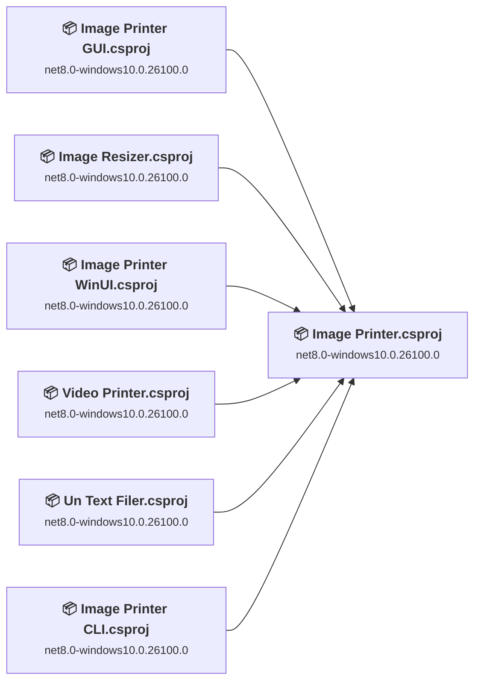
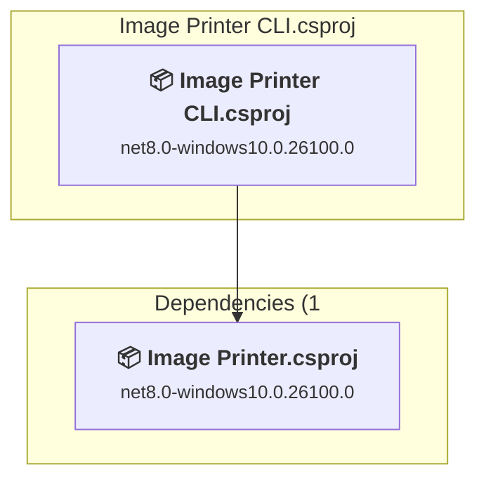
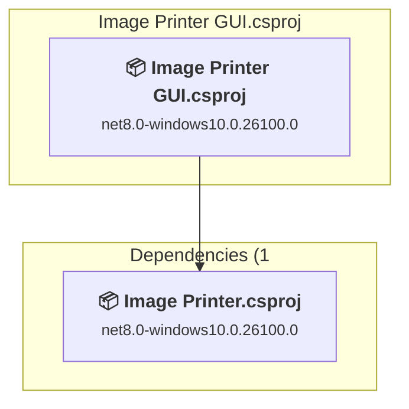
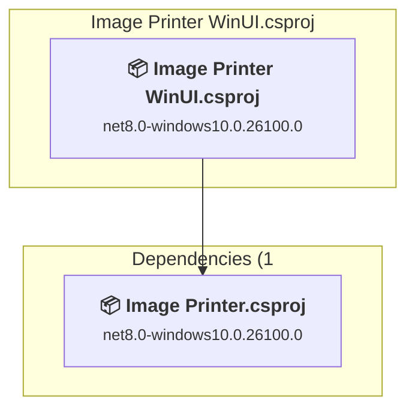
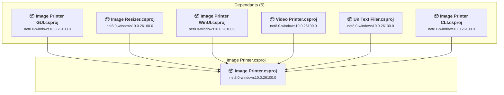
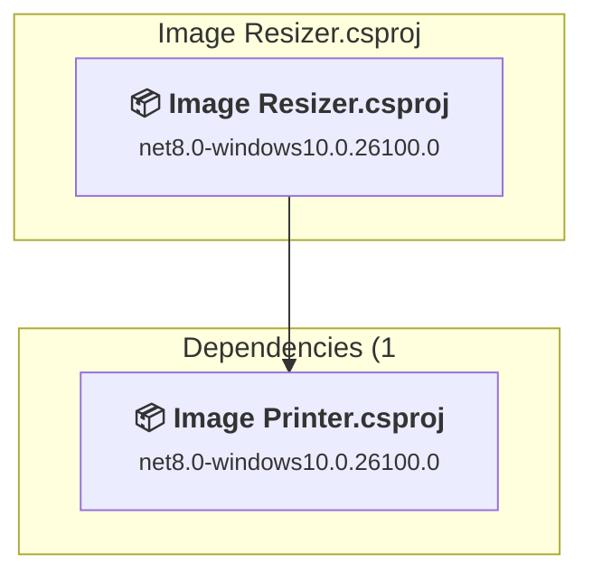
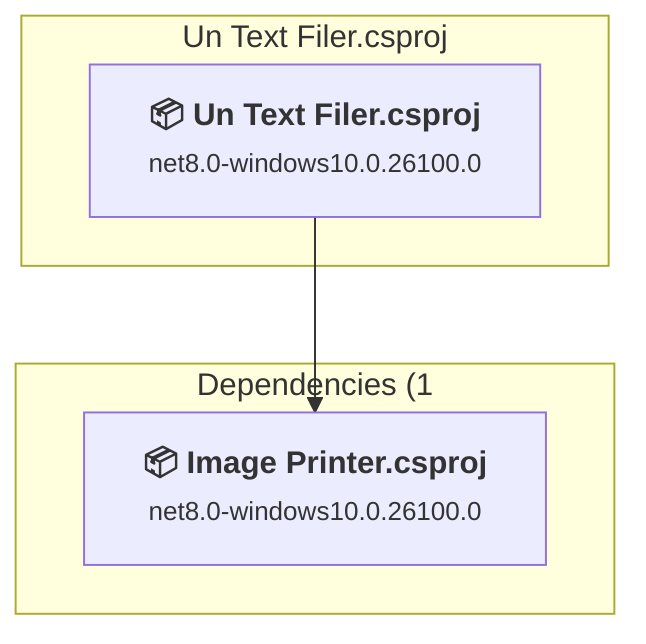
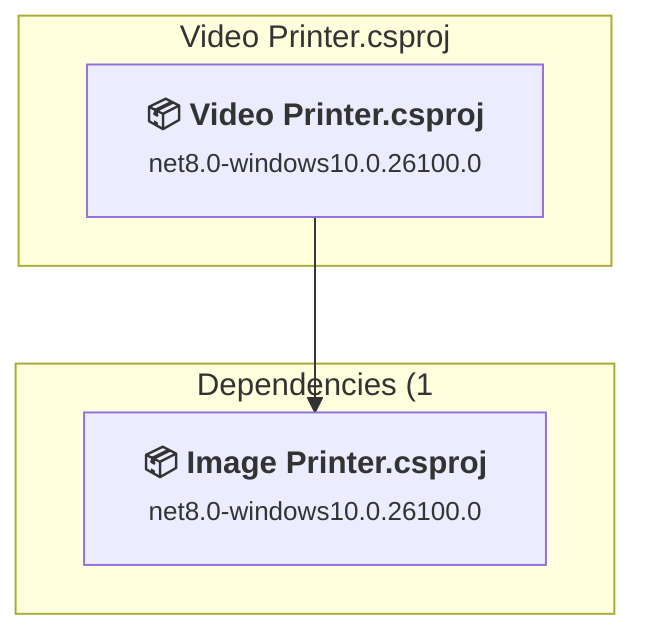

# Projects and dependencies analysis

This document provides a comprehensive overview of the projects and their dependencies in the context of upgrading to .NETCoreApp,Version=v10.0.

## Table of Contents

- [Executive Summary](#executive-Summary)
  - [Highlevel Metrics](#highlevel-metrics)
  - [Projects Compatibility](#projects-compatibility)
  - [Package Compatibility](#package-compatibility)
  - [API Compatibility](#api-compatibility)
- [Aggregate NuGet packages details](#aggregate-nuget-packages-details)
- [Top API Migration Challenges](#top-api-migration-challenges)
  - [Technologies and Features](#technologies-and-features)
  - [Most Frequent API Issues](#most-frequent-api-issues)
- [Projects Relationship Graph](#projects-relationship-graph)
- [Project Details](#project-details)

  - [Image Printer CLI\Image Printer CLI.csproj](#image-printer-cliimage-printer-clicsproj)
  - [Image Printer GUI\Image Printer GUI.csproj](#image-printer-guiimage-printer-guicsproj)
  - [Image Printer WinUI\Image Printer WinUI.csproj](#image-printer-winuiimage-printer-winuicsproj)
  - [Image Printer\Image Printer.csproj](#image-printerimage-printercsproj)
  - [Image Resizer\Image Resizer.csproj](#image-resizerimage-resizercsproj)
  - [Un Text Filer\Un Text Filer.csproj](#un-text-filerun-text-filercsproj)
  - [Video Printer\Video Printer.csproj](#video-printervideo-printercsproj)

## Executive Summary

### Highlevel Metrics

| Metric | Count | Status |
| :--- | :---: | :--- |
| Total Projects | 7 | All require upgrade |
| Total NuGet Packages | 5 | 2 need upgrade |
| Total Code Files | 11 |  |
| Total Code Files with Incidents | 19 |  |
| Total Lines of Code | 1126 |  |
| Total Number of Issues | 387 |  |
| Estimated LOC to modify | 373+ | at least 33.1% of codebase |

### Projects Compatibility

| Project | Target Framework | Difficulty | Package Issues | API Issues | Est. LOC Impact | Description |
| :--- | :---: | :---: | :---: | :---: | :---: | :--- |
| [Image Printer CLI\Image Printer CLI.csproj](#image-printer-cliimage-printer-clicsproj) | net8.0-windows10.0.26100.0 | 🟢 Low | 1 | 17 | 17+ | DotNetCoreApp, Sdk Style = True |
| [Image Printer GUI\Image Printer GUI.csproj](#image-printer-guiimage-printer-guicsproj) | net8.0-windows10.0.26100.0 | 🟡 Medium | 1 | 269 | 269+ | Wpf, Sdk Style = True |
| [Image Printer WinUI\Image Printer WinUI.csproj](#image-printer-winuiimage-printer-winuicsproj) | net8.0-windows10.0.26100.0 | 🟢 Low | 1 | 8 | 8+ | WinForms, Sdk Style = True |
| [Image Printer\Image Printer.csproj](#image-printerimage-printercsproj) | net8.0-windows10.0.26100.0 | 🟢 Low | 1 | 57 | 57+ | ClassLibrary, Sdk Style = True |
| [Image Resizer\Image Resizer.csproj](#image-resizerimage-resizercsproj) | net8.0-windows10.0.26100.0 | 🟢 Low | 1 | 11 | 11+ | DotNetCoreApp, Sdk Style = True |
| [Un Text Filer\Un Text Filer.csproj](#un-text-filerun-text-filercsproj) | net8.0-windows10.0.26100.0 | 🟢 Low | 1 | 8 | 8+ | DotNetCoreApp, Sdk Style = True |
| [Video Printer\Video Printer.csproj](#video-printervideo-printercsproj) | net8.0-windows10.0.26100.0 | 🟢 Low | 1 | 3 | 3+ | DotNetCoreApp, Sdk Style = True |

### Package Compatibility

| Status | Count | Percentage |
| :--- | :---: | :---: |
| ✅ Compatible | 3 | 60.0% |
| ⚠️ Incompatible | 0 | 0.0% |
| 🔄 Upgrade Recommended | 2 | 40.0% |
| ***Total NuGet Packages*** | ***5*** | ***100%*** |

### API Compatibility

| Category | Count | Impact |
| :--- | :---: | :--- |
| 🔴 Binary Incompatible | 231 | High - Require code changes |
| 🟡 Source Incompatible | 133 | Medium - Needs re-compilation and potential conflicting API error fixing |
| 🔵 Behavioral change | 9 | Low - Behavioral changes that may require testing at runtime |
| ✅ Compatible | 1700 |  |
| ***Total APIs Analyzed*** | ***2073*** |  |

## Aggregate NuGet packages details

| Package | Current Version | Suggested Version | Projects | Description |
| :--- | :---: | :---: | :--- | :--- |
| Microsoft.Windows.SDK.BuildTools | 10.0.26100.4948 |  | [Image Printer WinUI.csproj](#image-printer-winuiimage-printer-winuicsproj) | ✅Compatible |
| Microsoft.WindowsAppSDK | 1.8.250907003 |  | [Image Printer WinUI.csproj](#image-printer-winuiimage-printer-winuicsproj) | ✅Compatible |
| OpenCvSharp4.Windows | 4.10.0.20241108 |  | [Video Printer.csproj](#video-printervideo-printercsproj) | ✅Compatible |
| System.Drawing.Common | 8.0.11 | 10.0.3 | [Image Printer GUI.csproj](#image-printer-guiimage-printer-guicsproj) [Image Printer WinUI.csproj](#image-printer-winuiimage-printer-winuicsproj) [Image Printer.csproj](#image-printerimage-printercsproj) | NuGet package upgrade is recommended |
| System.Drawing.Common | 9.0.3 | 10.0.3 | [Image Printer CLI.csproj](#image-printer-cliimage-printer-clicsproj) [Image Resizer.csproj](#image-resizerimage-resizercsproj) [Un Text Filer.csproj](#un-text-filerun-text-filercsproj) [Video Printer.csproj](#video-printervideo-printercsproj) | NuGet package upgrade is recommended |

## Top API Migration Challenges

### Technologies and Features

| Technology | Issues | Percentage | Migration Path |
| :--- | :---: | :---: | :--- |
| WPF (Windows Presentation Foundation) | 162 | 43.4% | WPF APIs for building Windows desktop applications with XAML-based UI that are available in .NET on Windows. WPF provides rich desktop UI capabilities with data binding and styling. Enable Windows Desktop support: Option 1 (Recommended): Target net9.0-windows; Option 2: Add <UseWindowsDesktop>true</UseWindowsDesktop>. |
| GDI+ / System.Drawing | 129 | 34.6% | System.Drawing APIs for 2D graphics, imaging, and printing that are available via NuGet package System.Drawing.Common. Note: Not recommended for server scenarios due to Windows dependencies; consider cross-platform alternatives like SkiaSharp or ImageSharp for new code. |

### Most Frequent API Issues

| API | Count | Percentage | Category |
| :--- | :---: | :---: | :--- |
| T:System.Drawing.Bitmap | 52 | 13.9% | Source Incompatible |
| T:System.Windows.RoutedEventHandler | 26 | 7.0% | Binary Incompatible |
| T:System.Drawing.Imaging.ImageFormat | 24 | 6.4% | Source Incompatible |
| T:System.Windows.Controls.Button | 24 | 6.4% | Binary Incompatible |
| T:System.Windows.RoutedEventArgs | 11 | 2.9% | Binary Incompatible |
| T:System.Windows.Controls.Slider | 10 | 2.7% | Binary Incompatible |
| T:System.Windows.Controls.ItemCollection | 10 | 2.7% | Binary Incompatible |
| P:System.Windows.Controls.ItemsControl.Items | 10 | 2.7% | Binary Incompatible |
| T:System.Windows.Controls.TextBox | 8 | 2.1% | Binary Incompatible |
| E:System.Windows.Controls.Primitives.ButtonBase.Click | 8 | 2.1% | Binary Incompatible |
| T:System.Windows.Controls.ListBox | 8 | 2.1% | Binary Incompatible |
| P:System.Windows.Controls.Primitives.RangeBase.Value | 7 | 1.9% | Binary Incompatible |
| T:System.Windows.Controls.Menu | 6 | 1.6% | Binary Incompatible |
| T:System.Windows.Controls.TextBlock | 6 | 1.6% | Binary Incompatible |
| T:Microsoft.Win32.SaveFileDialog | 6 | 1.6% | Binary Incompatible |
| T:System.Uri | 5 | 1.3% | Behavioral Change |
| T:System.Windows.Controls.CheckBox | 5 | 1.3% | Binary Incompatible |
| T:System.Windows.Controls.Image | 5 | 1.3% | Binary Incompatible |
| T:System.Windows.Media.Imaging.BitmapSource | 5 | 1.3% | Binary Incompatible |
| P:Microsoft.Win32.FileDialog.FileName | 5 | 1.3% | Binary Incompatible |
| P:System.Drawing.Image.Width | 5 | 1.3% | Source Incompatible |
| T:System.Drawing.Imaging.FrameDimension | 4 | 1.1% | Source Incompatible |
| M:System.Drawing.Bitmap.#ctor(System.String) | 4 | 1.1% | Source Incompatible |
| P:System.Windows.Controls.TextBox.Text | 4 | 1.1% | Binary Incompatible |
| M:System.Windows.Controls.ItemCollection.Add(System.Object) | 4 | 1.1% | Binary Incompatible |
| M:System.Drawing.Bitmap.#ctor(System.Int32,System.Int32) | 4 | 1.1% | Source Incompatible |
| P:System.Drawing.Image.Height | 4 | 1.1% | Source Incompatible |
| P:System.Drawing.Image.RawFormat | 3 | 0.8% | Source Incompatible |
| E:System.Windows.Controls.MenuItem.Click | 3 | 0.8% | Binary Incompatible |
| T:System.Windows.Media.ImageSource | 3 | 0.8% | Binary Incompatible |
| P:System.Windows.Controls.Image.Source | 3 | 0.8% | Binary Incompatible |
| P:System.Windows.Controls.HeaderedItemsControl.Header | 3 | 0.8% | Binary Incompatible |
| T:Microsoft.Win32.OpenFileDialog | 3 | 0.8% | Binary Incompatible |
| M:System.Windows.Controls.ItemCollection.Clear | 3 | 0.8% | Binary Incompatible |
| P:System.Drawing.Imaging.FrameDimension.Time | 2 | 0.5% | Source Incompatible |
| P:System.Drawing.Imaging.ImageFormat.Gif | 2 | 0.5% | Source Incompatible |
| M:System.Uri.#ctor(System.String,System.UriKind) | 2 | 0.5% | Behavioral Change |
| T:System.Windows.Application | 2 | 0.5% | Binary Incompatible |
| T:System.Windows.Controls.TextChangedEventHandler | 2 | 0.5% | Binary Incompatible |
| P:System.Windows.Controls.TextBox.MaxLength | 2 | 0.5% | Binary Incompatible |
| P:System.Windows.FrameworkElement.Width | 2 | 0.5% | Binary Incompatible |
| P:System.Windows.Controls.Control.FontSize | 2 | 0.5% | Binary Incompatible |
| M:System.Windows.Controls.TextBox.#ctor | 2 | 0.5% | Binary Incompatible |
| P:System.Windows.Controls.TextBlock.Text | 2 | 0.5% | Binary Incompatible |
| M:Microsoft.Win32.CommonDialog.ShowDialog | 2 | 0.5% | Binary Incompatible |
| T:System.Windows.Media.Imaging.BitmapSizeOptions | 2 | 0.5% | Binary Incompatible |
| T:System.Windows.Int32Rect | 2 | 0.5% | Binary Incompatible |
| T:System.Windows.Controls.MenuItem | 2 | 0.5% | Binary Incompatible |
| M:System.Windows.Controls.MenuItem.#ctor | 2 | 0.5% | Binary Incompatible |
| M:System.Windows.Window.#ctor | 2 | 0.5% | Binary Incompatible |

## Projects Relationship Graph

Legend:
📦 SDK-style project
⚙️ Classic project

## Project Details

### Image Printer CLI\Image Printer CLI.csproj

#### Project Info

- **Current Target Framework:** net8.0-windows10.0.26100.0
- **Proposed Target Framework:** net10.0--windows10.0.26100.0
- **SDK-style**: True
- **Project Kind:** DotNetCoreApp
- **Dependencies**: 1
- **Dependants**: 0
- **Number of Files**: 1
- **Number of Files with Incidents**: 2
- **Lines of Code**: 104
- **Estimated LOC to modify**: 17+ (at least 16.3% of the project)

#### Dependency Graph

Legend:
📦 SDK-style project
⚙️ Classic project

### API Compatibility

| Category | Count | Impact |
| :--- | :---: | :--- |
| 🔴 Binary Incompatible | 0 | High - Require code changes |
| 🟡 Source Incompatible | 17 | Medium - Needs re-compilation and potential conflicting API error fixing |
| 🔵 Behavioral change | 0 | Low - Behavioral changes that may require testing at runtime |
| ✅ Compatible | 93 |  |
| ***Total APIs Analyzed*** | ***110*** |  |

#### Project Technologies and Features

| Technology | Issues | Percentage | Migration Path |
| :--- | :---: | :---: | :--- |
| GDI+ / System.Drawing | 17 | 100.0% | System.Drawing APIs for 2D graphics, imaging, and printing that are available via NuGet package System.Drawing.Common. Note: Not recommended for server scenarios due to Windows dependencies; consider cross-platform alternatives like SkiaSharp or ImageSharp for new code. |

### Image Printer GUI\Image Printer GUI.csproj

#### Project Info

- **Current Target Framework:** net8.0-windows10.0.26100.0
- **Proposed Target Framework:** net10.0-windows
- **SDK-style**: True
- **Project Kind:** Wpf
- **Dependencies**: 1
- **Dependants**: 0
- **Number of Files**: 3
- **Number of Files with Incidents**: 5
- **Lines of Code**: 304
- **Estimated LOC to modify**: 269+ (at least 88.5% of the project)

#### Dependency Graph

Legend:
📦 SDK-style project
⚙️ Classic project

### API Compatibility

| Category | Count | Impact |
| :--- | :---: | :--- |
| 🔴 Binary Incompatible | 231 | High - Require code changes |
| 🟡 Source Incompatible | 33 | Medium - Needs re-compilation and potential conflicting API error fixing |
| 🔵 Behavioral change | 5 | Low - Behavioral changes that may require testing at runtime |
| ✅ Compatible | 199 |  |
| ***Total APIs Analyzed*** | ***468*** |  |

#### Project Technologies and Features

| Technology | Issues | Percentage | Migration Path |
| :--- | :---: | :---: | :--- |
| GDI+ / System.Drawing | 33 | 12.3% | System.Drawing APIs for 2D graphics, imaging, and printing that are available via NuGet package System.Drawing.Common. Note: Not recommended for server scenarios due to Windows dependencies; consider cross-platform alternatives like SkiaSharp or ImageSharp for new code. |
| WPF (Windows Presentation Foundation) | 162 | 60.2% | WPF APIs for building Windows desktop applications with XAML-based UI that are available in .NET on Windows. WPF provides rich desktop UI capabilities with data binding and styling. Enable Windows Desktop support: Option 1 (Recommended): Target net9.0-windows; Option 2: Add <UseWindowsDesktop>true</UseWindowsDesktop>. |

### Image Printer WinUI\Image Printer WinUI.csproj

#### Project Info

- **Current Target Framework:** net8.0-windows10.0.26100.0
- **Proposed Target Framework:** net10.0-windows10.0.26100.0
- **SDK-style**: True
- **Project Kind:** WinForms
- **Dependencies**: 1
- **Dependants**: 0
- **Number of Files**: 24
- **Number of Files with Incidents**: 4
- **Lines of Code**: 249
- **Estimated LOC to modify**: 8+ (at least 3.2% of the project)

#### Dependency Graph

Legend:
📦 SDK-style project
⚙️ Classic project

### API Compatibility

| Category | Count | Impact |
| :--- | :---: | :--- |
| 🔴 Binary Incompatible | 0 | High - Require code changes |
| 🟡 Source Incompatible | 4 | Medium - Needs re-compilation and potential conflicting API error fixing |
| 🔵 Behavioral change | 4 | Low - Behavioral changes that may require testing at runtime |
| ✅ Compatible | 1127 |  |
| ***Total APIs Analyzed*** | ***1135*** |  |

### Image Printer\Image Printer.csproj

#### Project Info

- **Current Target Framework:** net8.0-windows10.0.26100.0
- **Proposed Target Framework:** net10.0--windows10.0.26100.0
- **SDK-style**: True
- **Project Kind:** ClassLibrary
- **Dependencies**: 0
- **Dependants**: 6
- **Number of Files**: 1
- **Number of Files with Incidents**: 2
- **Lines of Code**: 291
- **Estimated LOC to modify**: 57+ (at least 19.6% of the project)

#### Dependency Graph

Legend:
📦 SDK-style project
⚙️ Classic project

### API Compatibility

| Category | Count | Impact |
| :--- | :---: | :--- |
| 🔴 Binary Incompatible | 0 | High - Require code changes |
| 🟡 Source Incompatible | 57 | Medium - Needs re-compilation and potential conflicting API error fixing |
| 🔵 Behavioral change | 0 | Low - Behavioral changes that may require testing at runtime |
| ✅ Compatible | 171 |  |
| ***Total APIs Analyzed*** | ***228*** |  |

#### Project Technologies and Features

| Technology | Issues | Percentage | Migration Path |
| :--- | :---: | :---: | :--- |
| GDI+ / System.Drawing | 57 | 100.0% | System.Drawing APIs for 2D graphics, imaging, and printing that are available via NuGet package System.Drawing.Common. Note: Not recommended for server scenarios due to Windows dependencies; consider cross-platform alternatives like SkiaSharp or ImageSharp for new code. |

### Image Resizer\Image Resizer.csproj

#### Project Info

- **Current Target Framework:** net8.0-windows10.0.26100.0
- **Proposed Target Framework:** net10.0--windows10.0.26100.0
- **SDK-style**: True
- **Project Kind:** DotNetCoreApp
- **Dependencies**: 1
- **Dependants**: 0
- **Number of Files**: 1
- **Number of Files with Incidents**: 2
- **Lines of Code**: 38
- **Estimated LOC to modify**: 11+ (at least 28.9% of the project)

#### Dependency Graph

Legend:
📦 SDK-style project
⚙️ Classic project

### API Compatibility

| Category | Count | Impact |
| :--- | :---: | :--- |
| 🔴 Binary Incompatible | 0 | High - Require code changes |
| 🟡 Source Incompatible | 11 | Medium - Needs re-compilation and potential conflicting API error fixing |
| 🔵 Behavioral change | 0 | Low - Behavioral changes that may require testing at runtime |
| ✅ Compatible | 17 |  |
| ***Total APIs Analyzed*** | ***28*** |  |

#### Project Technologies and Features

| Technology | Issues | Percentage | Migration Path |
| :--- | :---: | :---: | :--- |
| GDI+ / System.Drawing | 11 | 100.0% | System.Drawing APIs for 2D graphics, imaging, and printing that are available via NuGet package System.Drawing.Common. Note: Not recommended for server scenarios due to Windows dependencies; consider cross-platform alternatives like SkiaSharp or ImageSharp for new code. |

### Un Text Filer\Un Text Filer.csproj

#### Project Info

- **Current Target Framework:** net8.0-windows10.0.26100.0
- **Proposed Target Framework:** net10.0--windows10.0.26100.0
- **SDK-style**: True
- **Project Kind:** DotNetCoreApp
- **Dependencies**: 1
- **Dependants**: 0
- **Number of Files**: 1
- **Number of Files with Incidents**: 2
- **Lines of Code**: 83
- **Estimated LOC to modify**: 8+ (at least 9.6% of the project)

#### Dependency Graph

Legend:
📦 SDK-style project
⚙️ Classic project

### API Compatibility

| Category | Count | Impact |
| :--- | :---: | :--- |
| 🔴 Binary Incompatible | 0 | High - Require code changes |
| 🟡 Source Incompatible | 8 | Medium - Needs re-compilation and potential conflicting API error fixing |
| 🔵 Behavioral change | 0 | Low - Behavioral changes that may require testing at runtime |
| ✅ Compatible | 39 |  |
| ***Total APIs Analyzed*** | ***47*** |  |

#### Project Technologies and Features

| Technology | Issues | Percentage | Migration Path |
| :--- | :---: | :---: | :--- |
| GDI+ / System.Drawing | 8 | 100.0% | System.Drawing APIs for 2D graphics, imaging, and printing that are available via NuGet package System.Drawing.Common. Note: Not recommended for server scenarios due to Windows dependencies; consider cross-platform alternatives like SkiaSharp or ImageSharp for new code. |

### Video Printer\Video Printer.csproj

#### Project Info

- **Current Target Framework:** net8.0-windows10.0.26100.0
- **Proposed Target Framework:** net10.0--windows10.0.26100.0
- **SDK-style**: True
- **Project Kind:** DotNetCoreApp
- **Dependencies**: 1
- **Dependants**: 0
- **Number of Files**: 1
- **Number of Files with Incidents**: 2
- **Lines of Code**: 57
- **Estimated LOC to modify**: 3+ (at least 5.3% of the project)

#### Dependency Graph

Legend:
📦 SDK-style project
⚙️ Classic project

### API Compatibility

| Category | Count | Impact |
| :--- | :---: | :--- |
| 🔴 Binary Incompatible | 0 | High - Require code changes |
| 🟡 Source Incompatible | 3 | Medium - Needs re-compilation and potential conflicting API error fixing |
| 🔵 Behavioral change | 0 | Low - Behavioral changes that may require testing at runtime |
| ✅ Compatible | 54 |  |
| ***Total APIs Analyzed*** | ***57*** |  |

#### Project Technologies and Features

| Technology | Issues | Percentage | Migration Path |
| :--- | :---: | :---: | :--- |
| GDI+ / System.Drawing | 3 | 100.0% | System.Drawing APIs for 2D graphics, imaging, and printing that are available via NuGet package System.Drawing.Common. Note: Not recommended for server scenarios due to Windows dependencies; consider cross-platform alternatives like SkiaSharp or ImageSharp for new code. |

